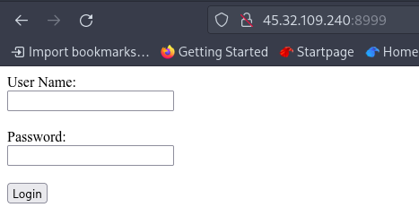
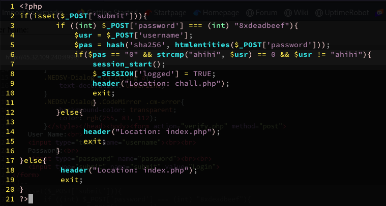
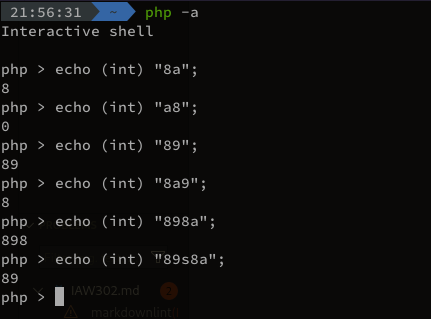
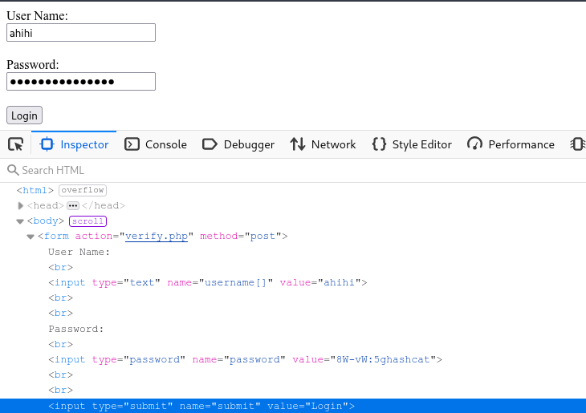
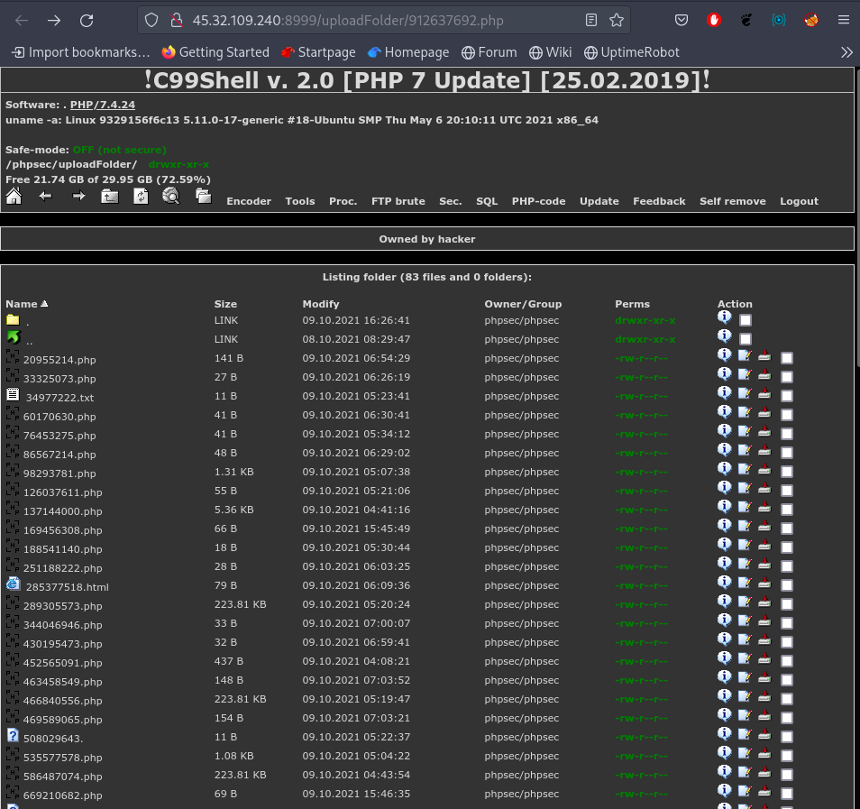

# IAW302

> Bài này rất đúng với mô tả của người ra đề, một người anh (không hề) lừa: "G(old)". Một ví dụ điển hình cho một lỗi điển hình của PHP String :))

- Truy cập vào bài, ta có login form:

    

- Thử xem source code của bài xem sao? (Source code khá dài, nên mình sẽ cắt từ đoạn form đến hết hint)

    ```html
        <form action="verify.php" method="post">
            User Name:<br>
            <input type="text" name="username"><br><br>
            Password:<br>
            <input type="password" name="password"><br><br>
            <input type="submit" name="submit" value="Login">
        </form>
        <!--
        if(isset($_POST['submit'])){
                if ((int) $_POST['password'] === (int) "8xdeadbeef"){
                    $usr = $_POST['username'];
                    $pas = hash('sha256', htmlentities($_POST['password']));
                    if($pas == "0" && strcmp("ahihi", $usr) == 0 && $usr != "ahihi"){
                        session_start();
                        $_SESSION['logged'] = TRUE;
                        header("Location: chall.php");
                        exit;
                        }
                }else{

                    header("Location: index.php");
                    exit;
                }
        }else{
                header("Location: index.php");
                exit;
        }
        ?>
    ```

- Vậy là chúng ta có gợi ý về code PHP của back-end, hãy thử phân tích nó một chút, để dễ dàng theo dõi, mình sẽ gán đoạn PHP vào Vim để nhìn theo line-number:

    

- Tại dòng thứ 3, ta có thể thấy toán tử so sánh `===` (cùng loại, cùng giá trị), `(int) "8xdeadbeef"` có giá trị là `8`, như vậy password cần mang giá trị `8` khi ép về `int`

- Nói qua một chút về việc ép `String` về `Integer` trong PHP, hãy để ý chuỗi `8xdeafbeef`, chuỗi này bắt đầu bằng số `8`, nên khi ép về `int` thì sẽ mang luôn giá trị là `8`, để dễ hình dung thì chúng ta thử trên PHP luôn:

    

- Như vậy ta biết password sẽ bắt đầu bằng `8` và kế tiếp là các kí tự không phải kí tự số như `8anhtunglua` chẳng hạn :>

- Ta biết password sẽ được hash `SHA256`, và không có salt (Dòng 5)

- Tại dòng 6 ta có 3 điều kiện với 3 phép so sánh: `==` và `!=` (so sánh giá trị, không so sánh kiểu) và `strcmp()` (so sánh 2 string, trả về 0 nếu giống nhau):

- Hãy để ý đến phép so sánh `$pas == "0"`, đây là một huyền thoại của PHP :> Ta biết rằng `$pas` được hash `SHA256` rồi mới đem vào so sánh, phép so sánh `==` giữa một chuỗi hash và `"0"` trong PHP sẽ gây ra lỗi liên quan đến Magic Hash, cụ thể thì những chuỗi hash bắt đầu bằng `"0e"`, khi so sánh `==` với `"0"` sẽ luôn trả về giá trị đúng xD, bạn có thể tìm hiểu về magic hash, không chỉ `SHA256` mà còn nhiều dạng khác [tại đây](https://github.com/spaze/hashes)

- Như vậy, password phải bắt đầu bằng `8` và có mã hash SHA256 bắt đầu bằng `"0e"`, theo link ở trên, mình tìm được mã này:

    ```text
        8W-vW:5ghashcat:0e99625202804787226908207582077273485674961623832383874594371630 (note: the plaintext has a colon in the middle)
    ```

- Như vậy password sẽ là `8W-vW:5ghashcat`

- Tiếp đến 2 điều kiện còn lại của dòng 6: `strcmp("ahihi", $usr) == 0 && $usr != "ahihi"` :D ???

- Mới đầu đọc mình cũng hơi bị lú tí, làm thế nào mà `strcmp` thì trả về 0 (giống nhau) mà đằng sau lại khác nhau cho được :D ???, nhưng, có một điều về `strcmp` trong PHP, hay nói đúng hơn là cái `==` chết tiệt của PHP:

  - Trong PHP, khi so sánh `NULL == 0` thì sẽ trả về true :D ??? Không đùa đâu, nó trả về true thật :> Đọc thêm tại [đây](https://www.php.net/manual/en/types.comparisons.php)

  - Có một cách để khiến `strcmp` trả về `NULL`, đó là so sánh `Array` và `String` :> Hãy đọc thêm tại [đây](https://www.doyler.net/security-not-included/bypassing-php-strcmp-abctf2016)

- Như vậy điều ta cần là nhập username dưới dạng `Array`, but how to do that?

- Để ý đến source code form của username: `<input type="text" name="username">`, ta thấy khi submit, query string sẽ có dạng `?username=anything&password=anything` đúng không? Vậy muốn đổi từ `?username=` sang `?username[]=` thì đơn giản ta chỉ cần sửa lại code HTML của username form thành `<input type="text" name="username[]">`

- Bây giờ tiến hành nhập username (mình để `ahihi` cho theo ý thích của người ra đề :>) và password `8W-vW:5ghashcat` và đây là kết quả:

    

    

- Ta đã vào được trang `chall.php` đúng như điều kiện của back-end PHP ở trên, Ctrl U để xem source code nào:

```php
    if(isset($_FILES['file'])){
      if($_FILES['file']['size'] > 1048576){
         $errors='File size must be excately 1 MB';
      }

      if(empty($errors)==true){
        $up = "uploads/".rand().".".explode(".",$_FILES['file']['name'])[1];
        move_uploaded_file($_FILES['file']['tmp_name'],$up);
        echo "File uploaded successfully\n";
        echo '<p><a href='. $up .' target="_blank">File</a></p>';
      }else{
         echo $errors;
      }
   }
```

- Đây là source code PHP cho phần upload file, có thể thấy ta có thể upload bất cứ file gì, miễn là đừng vượt quá `1048576 bytes` là được

- Mình sử dụng một file có tên là [c99shell.php](https://github.com/KaizenLouie/C99Shell-PHP7) để upload, truy cập vào file và ta có toàn bộ file được upload lên :v

    

- Lul, có vẻ flag không có ở đây, và nếu để ý thì tất cả file đều chỉ có quyền `read` mà thôi :v như vậy mình không thể dùng command rồi :v mình thử truy cập vào thư mục cha của thư mục hiện tại, và mình thấy file này:

    

- Thử dùng path traversal để mở file `fl@@@g_1337_ahiahi.txt` xem sao :v

    

- Vậy là đã có flag: `FUSec{Muốn giết một con rồng, máu phải chảy thành sông_Tai nạn quá, không sao, winable, winable guys}`

> Một bài khá dài hơi, flag này chả trách ông anh T giấu tên cứ nhắc đến "Kẻ giết rồng" :))
